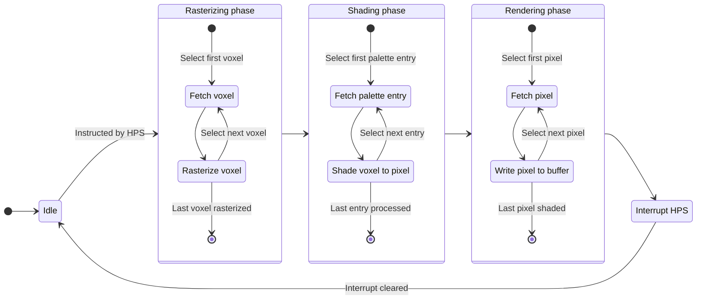

```mermaid
stateDiagram-v2
    direction LR
    idle: Idle
    %% metastates
    rasterizing: Rasterizing phase
    shading: Shading phase
    writeout: Rendering phase
    %% end metastates
    fetch_voxel: Fetch voxel
    rasterize: Rasterize voxel
    fetch_entry: Fetch palette entry
    shade: Shade voxel to pixel
    fetch_pixel: Fetch pixel
    write: Write pixel to buffer
    interrupt: Interrupt HPS

    [*] --> idle
    idle --> rasterizing: Instructed by HPS
    state rasterizing {
        [*] --> fetch_voxel: Select first voxel
        fetch_voxel --> rasterize
        rasterize --> fetch_voxel: Select next voxel
        rasterize --> [*]: Last voxel rasterized
    }
    rasterizing --> shading
    state shading {
        [*] --> fetch_entry: Select first palette entry
        fetch_entry --> shade
        shade --> fetch_entry: Select next entry
        shade --> [*]: Last entry processed
    }
    shading --> writeout
    state writeout {
        [*] --> fetch_pixel: Select first pixel
        fetch_pixel --> write
        write --> fetch_pixel: Select next pixel
        write --> [*]: Last pixel shaded
    }
    writeout --> interrupt
    interrupt --> idle: Interrupt cleared
```
