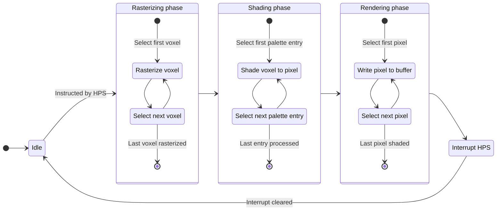

```mermaid
stateDiagram-v2
    direction LR
    idle: Idle
    %% metastates
    rasterizing: Rasterizing phase
    shading: Shading phase
    writeout: Rendering phase
    %% end metastates
    rasterize: Rasterize voxel
    next_voxel: Select next voxel
    shade: Shade voxel to pixel
    next_entry: Select next palette entry
    write: Write pixel to buffer
    next_pixel: Select next pixel
    interrupt: Interrupt HPS

    [*] --> idle
    idle --> rasterizing: Instructed by HPS
    state rasterizing {
        [*] --> rasterize: Select first voxel
        rasterize --> next_voxel
        next_voxel --> rasterize
        next_voxel --> [*]: Last voxel rasterized
    }
    rasterizing --> shading
    state shading {
        [*] --> shade: Select first palette entry
        shade --> next_entry
        next_entry --> shade
        next_entry --> [*]: Last entry processed
    }
    shading --> writeout
    state writeout {
        [*] --> write: Select first pixel
        write --> next_pixel
        next_pixel --> write
        next_pixel --> [*]: Last pixel shaded
    }
    writeout --> interrupt
    interrupt --> idle: Interrupt cleared
```
