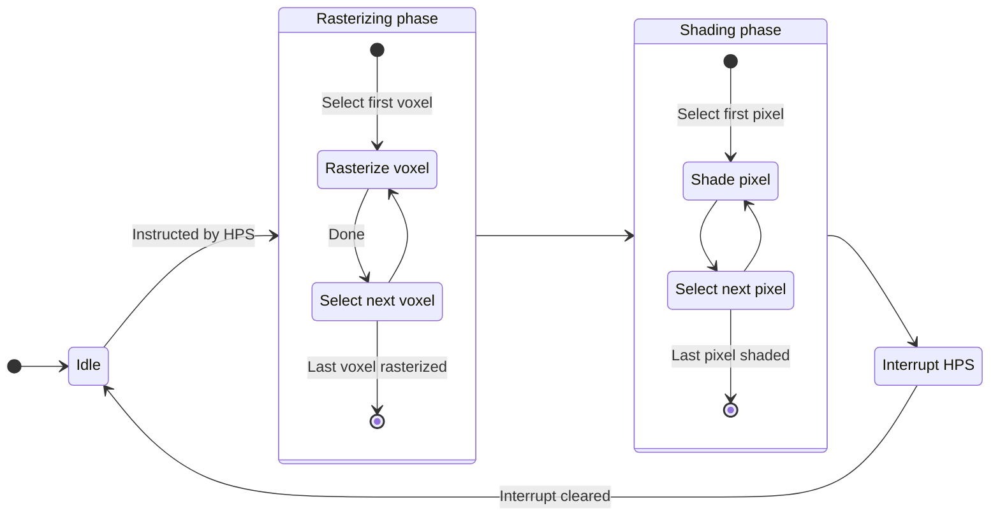

```mermaid
stateDiagram-v2
    direction LR
    idle: Idle
    rasterizing: Rasterizing phase
    shading: Shading phase
    rasterize: Rasterize voxel
    next_voxel: Select next voxel
    shade: Shade pixel
    next_pixel: Select next pixel
    interrupt: Interrupt HPS

    [*] --> idle
    idle --> rasterizing: Instructed by HPS
    state rasterizing {
        [*] --> rasterize: Select first voxel
        rasterize --> next_voxel: Done
        next_voxel --> rasterize
        next_voxel --> [*]: Last voxel rasterized
    }
    rasterizing --> shading
    state shading {
        [*] --> shade: Select first pixel
        shade --> next_pixel
        next_pixel --> shade
        next_pixel --> [*]: Last pixel shaded
    }
    shading --> interrupt
    interrupt --> idle: Interrupt cleared
```
