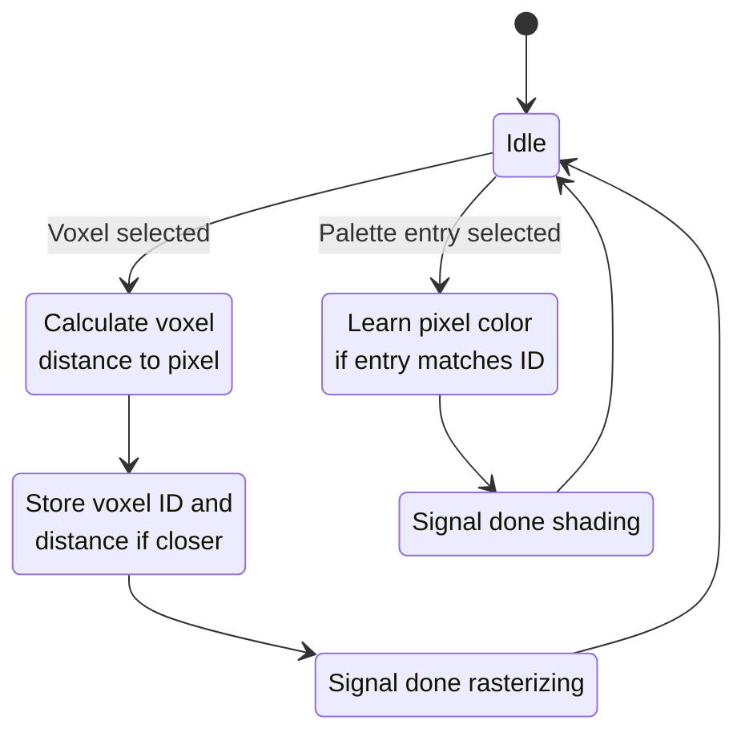

```mermaid
stateDiagram-v2
    idle: Idle
    measure: Calculate voxel<br>distance to pixel
    store_voxel: Store voxel ID and<br>distance if closer
    done_rasterizing: Signal done rasterizing
    store_pixel: Learn pixel color<br>if entry matches ID
    done_shading: Signal done shading

    [*] --> idle
    idle --> measure: Voxel selected
	measure --> store_voxel
	store_voxel --> done_rasterizing
	done_rasterizing --> idle
    idle --> store_pixel: Palette entry selected
    store_pixel --> done_shading
    done_shading --> idle
```
