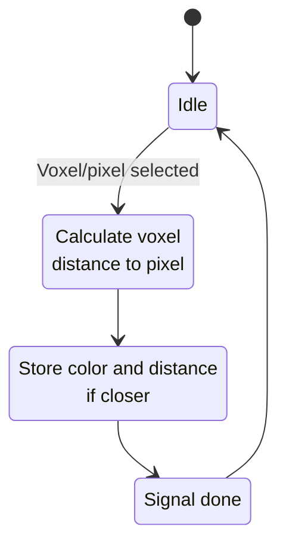

```mermaid
stateDiagram-v2
    idle: Idle
    measure: Calculate voxel<br>distance to pixel
    store: Store color and distance<br>if closer
    done: Signal done

    [*] --> idle
    idle --> measure: Voxel/pixel selected
	measure --> store
	store --> done
	done --> idle
```
